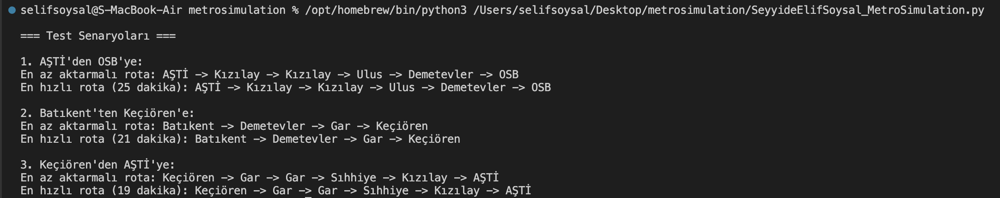
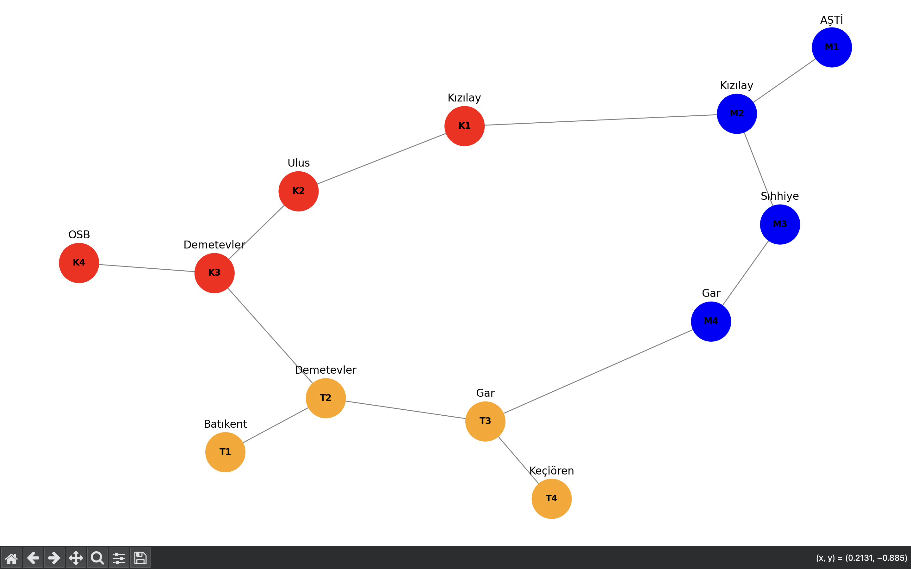

# Sürücüsüz Metro Simülasyonu (Rota Optimizasyonu)

Bu proje, bir şehirdeki metro ağı üzerinde en az aktarma yaparak ve en hızlı şekilde bir istasyondan başka bir istasyona nasıl gidebileceğimizi hesaplamak için yazılmıştır. İstasyonlar arasındaki bağlantıları ve hatları göz önünde bulundurarak, kullanıcıya farklı rotalar önerilir.

## Kullanılan Teknolojiler ve Kütüphaneler

- Python 3.x : Proje Python dili ile yazılmıştır.
- networkx: Metro ağı ve istasyonlar arasındaki bağlantıları görselleştirmek için kullanılmıştır.
- matplotlib: Grafikleri çizmek için kullanılır.
- heapq: En hızlı rotayı bulmak için kullanılan öncelikli kuyruk (priority queue).
- collections: Veri yapıları için kullanılan kütüphane (örneğin `deque`, `defaultdict` gibi).

## Algoritmaların Çalışma Mantığı

### BFS (Breadth-First Search) Algoritması

BFS, en az aktarmalı rotayı bulmak için kullanılan bir algoritmadır. Çalışma şekli:
1. Başlangıç istasyonu kuyrukta ilk sıraya eklenir.
2. Kuyrukta sırayla her istasyon ve komşuları (bağlantılı istasyonlar) kontrol edilir.
3. Eğer bir istasyona başka bir hat ile gidilebiliyorsa, bu yeni hat kullanılır.
4. Hedef istasyon bulunana kadar bu işlem devam eder.
BFS algoritması, aktarmaların sayısını minimize etmek için tercih edilir çünkü her seferinde en yakın komşu istasyonları kontrol eder.

### A* Algoritması

A* algoritması, en hızlı rotayı bulmak için kullanılır. Çalışma şekli:
1. Başlangıç istasyonu, öncelikli kuyruğa eklenir.
2. Kuyruktan en düşük toplam süreye sahip istasyon seçilir ve komşuları kontrol edilir.
3. Her komşunun toplam süresi hesaplanır ve bu komşular kuyruktan tekrar işlenir.
4. Hedef istasyon bulunana kadar bu işlem devam eder.
A* algoritması, her adımda en hızlı yolu seçmek için etkili bir algoritmadır.

### Neden Bu Algoritmalar Kullanıldı?

- BFS, aktarma sayısını en az yaparak ulaşmak için iyi bir yöntemdir. Yani, bir yerden bir yere giderken en az aktarma yapmamızı sağlar.
- A* Algoritması, en kısa sürede hedefe ulaşmak için uygundur. Yani, her adımda zaman kaybını minimuma indirir.

## Örnek Kullanım ve Test Sonuçları

=== Test Senaryoları ===

1. AŞTİ'den OSB'ye:
En az aktarmalı rota: AŞTİ -> Kızılay -> Kızılay -> Ulus -> Demetevler -> OSB
En hızlı rota (25 dakika): AŞTİ -> Kızılay -> Kızılay -> Ulus -> Demetevler -> OSB

2. Batıkent'ten Keçiören'e:
En az aktarmalı rota: Batıkent -> Demetevler -> Gar -> Keçiören
En hızlı rota (21 dakika): Batıkent -> Demetevler -> Gar -> Keçiören

3. Keçiören'den AŞTİ'ye:
En az aktarmalı rota: Keçiören -> Gar -> Gar -> Sıhhiye -> Kızılay -> AŞTİ
En hızlı rota (19 dakika): Keçiören -> Gar -> Gar -> Sıhhiye -> Kızılay -> AŞTİ

## Ek Geliştirme

Ayrıca projede istasyonlar ve hatlar görselleştirilmiştir.

## Geliştirme Fikirleri

Proje bulunulan ve hedef istasyon dinamik olarak seçilen ve rota belirlenen bir uygulama/site haline getirilebilir.